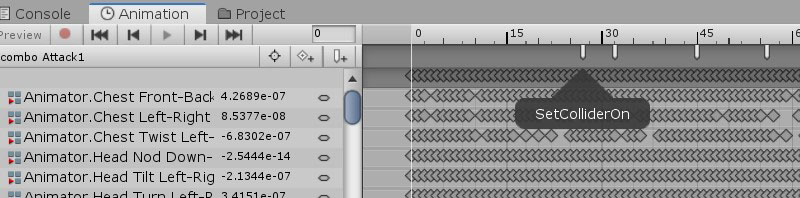

 
<!--

 양식

 **타이틀**
- **개요표**
- **플레이 이미지 또는 영상링크**
- **플레이해보기** 
- **주요 작업 목록**
- **활용 기술 / 기법**
-->


# < 잠자는 파인애옹의 포트폴리오 >

----------


# 짭크소울(환불군다)

| 타이틀 | 개발환경 | 제작기간 | Platform |  카테고리 | 비고 
| ---- | ---- | ---- | ---- | ---- | ---- 
| [짭크소울(환불군다)](RefundGundyr/README.md)| Unity 3D, C# | 7주 | Windows | RPG | DarkSouls3 첫번째 보스전을 모티브로 제작 

>다크소울3의 첫번째 보스, 영웅군다전을 모티브로 제작하였습니다.
>처음 계획은 3주였지만, 완성도를 높이고 보다 확실한 공부를 위해 7주로 수정, 진행하였습니다.

  
*이것은 환불하고 싶어도 할 수 없다* 

* [유튜브 제작과정 영상 바로가기](https://www.youtube.com/playlist?list=PLwLVhT_yp_32-EtXwbar1XV_eExhXsAxR)
* 전체 플레이 영상은 준비중 *  


### 플레이해보기
* [(준비중)]()

### 주요 기능 및 활용 기술
1. 함수를 이용한 카메라 제어와 플레이어 이동  
- 플레이어가 LockOn상태이면  
-- 플레이어의 모든 이동은 타겟을 바라보며 이동한다.  
-- 카메라의 시점은 타겟에 고정된다.  

```C#
//플레이어 함수
private void SetForceFrontView()
    {
        //캐릭터가 정면을 보고 있지 않는다면
        if (targetDirection != Vector3.zero)
        {
           moveDirection = Vector3.RotateTowards(moveDirection, targetDirection, 360 * Mathf.Deg2Rad * Time.deltaTime,0);

           moveDirection = moveDirection.normalized;
        }
    }
```
```C#
//카메라 함수
   if (!playerCtrl.isLockOn)
   {
      x += Input.GetAxis("Mouse X") * 4.0f;
      y -= Input.GetAxis("Mouse Y") * 1.6f;
      y = Mathf.Clamp(y, -9.5f, 80);
      ...
   }

   else if (playerCtrl.isLockOn)
   {
       //플레이어와 회전방향이 일치하도록하기
       rotation = Quaternion.Lerp(transform.rotation, cameraTarget.transform.rotation, 0.6f);
       targetPos = cameraTarget.position + targetOffset;
       direction = rotation * - Vector3.forward;
       float targetDistance = AdjustLineOfSight(targetPos, direction);
       currentDistance = Mathf.SmoothDamp(currentDistance, targetDistance, ref distanceVelocity, 0.1f);
       transform.rotation = rotation;
       transform.position = Vector3.MoveTowards(transform.position, targetPos + direction * currentDistance, distance);
   }
```
2. Animation Event를 이용한 Collider 제어 및 사운드 재생
- 특정 애니메이션 구간에서만 Collider활성화를 위해 Event로 함수 호출
  
```C#
    public void SetColliderOn()
    {
        capsuleCollider.enabled = true;
    }
    public void SetColliderOFF()
    {
        capsuleCollider.enabled = false;

    }
```
3.StateMachineBehaviour를 이용한 특정 애니메이션 재생 중의 함수 호출
- 플레이어의 이동속도가 걷는 속도보다 빠르면 스테미너를 감소하도록 함. 
```C#
public class RunState : StateMachineBehaviour
{
    PlayerCtrl charaCtrl = null;
    private readonly int hashSpeed = Animator.StringToHash("speed");

    public override void OnStateEnter(Animator animator, AnimatorStateInfo stateInfo, int layerIndex)
    {
        if (charaCtrl == null)
        {
            charaCtrl = animator.GetComponentInParent<PlayerCtrl>();
        }
    }
    override public void OnStateUpdate(Animator animator, AnimatorStateInfo stateInfo, int layerIndex)
    {
        if (animator.GetFloat("speed") > charaCtrl.WalkSpeed && Input.GetKey(KeyCode.LeftShift))
        {
            charaCtrl.ReduceStaminaAtRunning();
        }
    }
}
```


[◀ 목차로 돌아가기](https://github.com/Song-In-Love/pinaeongs-portfolios/blob/master/README.md#목차)


----------
<center> ⓒ 2020, SONG IN AE </center>

