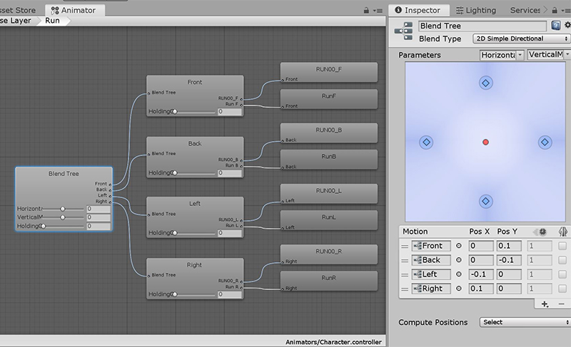


# < 잠자는 파인애옹의 포트폴리오 >

----------

# 스페이스 슈터 유니티쨩

| 타이틀 | 개발환경 | 제작기간 | Platform |  카테고리 | 비고 
| ---- | ---- | ---- | ---- | ---- | ---- 
| 스페이스 슈터 유니티쨩 | Unity3D, C# | 2주 | Window, Android | FPS | Unity3D 첫 작품, <절대강좌!유니티> 예제 어레인지 

  

*우락부락 머머리 악당을 물리치는 미소녀 유니티쨩*

### 게임 다운로드 
- [SpaceShooterUnityChan_(for Window).zip(52MB)](https://drive.google.com/file/d/1t7QU2IXR2Jri65ziDTloHT34cgnVfQKO) - (전체화면 해상도 플레이 권장) 

- [SpaceShooterUnityChan.apk(51MB)](https://drive.google.com/open?id=1NFBMbCH-Ee_4T5q2HKA0Q-IFbq7ibfGi)

###  주요 작업 목록
|  | ★★★ | ★★ | ★ | 
|---- | ---- | ---- | ---- |
| 기여도 | 미니맵 - 플레이어와 주변의 몬스터 위치 보이게 해주기 | 자동발사 - 플레이어가 적을 바라 볼 때 자동으로 총알이 발사됨 | 조이스틱 장착 - 안드로이드 빌드시 케릭터 이동 가능 |
| 난이도 | (소요시간 ★★★ 과 동일) | (기여도 ★★★과 동일) | (기여도 ★과 동일) |
| 소요시간 | 모델에 애니메이션 적용 - 기존의 애니메이션 적용 시 캐릭터의 발이 돌아있어서 고치는 방법 찾는데 시간이 오래 걸림, 리깅 문제|  라이트 프로브 적용 및 베이크 - 인게임에서 원하는 조명 색상으로 나오게 하기 | 무기 장착 및 발사 시, 원하는 위치로 총알이 발사되게 Rotation 조절 |

### 활용 기술/기법
1. Asset store Character + Mixamo Animation 으로 신규 메카님 제작 
2. Blend Tree를 이용한 애니메이터 제작  
  
2. 모바일 플레이를 위한 조이스틱 Asset 적용 및 수정  
3. Camera Culling Mask 및 Layer 활용한 미니맵  

*<절대강좌!유니티>의 내용과 크게 다르거나, 없는 내용 위주로 작성했습니다.*

[◀ 목차로 돌아가기](/Song-In-Love/pinaeongs-portfolios/blob/master/README.md) 

----------

 ⓒ 2020, SONG IN AE 

