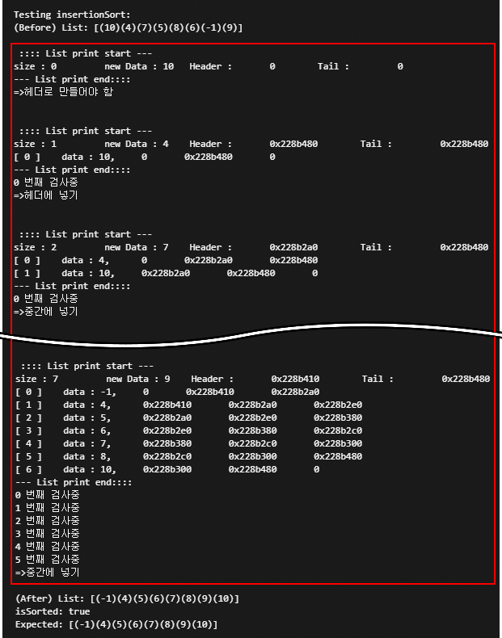
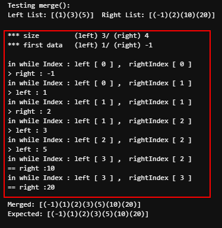

# < 잠자는 파인애옹의 포트폴리오 >


> 기본적으로 과제/시험에 사용된 코드는 해당 기관에 종속되어 일부만 올립니다.  
> 첨부된 코드에서 출력용 구문은 삭제하였습니다.  
> 실행 중 오류 발생 시, 원인을 쉽게 파악하고자 주어진 size()함수 활용, for문 사용했습니다  


## Object-Oriented Data Structures in C++ 
### 과제 내용
1. insertOrdered 함수 완성하기 : 숫자를 입력받으면 doubly-linked list에 오름차순으로 입력하기
2. merge 함수 완성하기 : 두개의 doubly-linked list를 오름차순으로 병합하기

---
### 과제 1 ( insertOrdered 함수 완성하기) 


 list 내부를 순회하며 head를 시작으로 한 타겟의 data, 타겟의 next의 data, 입력받은 data 3개의 크기를 각각 비교 후, 비교 결과에 따라 다음과 같이 처리합니다. 
 - 새로운 head로 추가 
 - 중간에 삽입(타겟의 뒤에 삽입)  
 - 계속 비교 진행 
 - 새로운 tail로 추가  


```C++

    Node* frontNode = head_;

    bool isNewHeader = false;
    bool isNewTail = false;
 
    Node* printedNode = head_;

    if (size() == 0)
    {
        isNewHeader = true;
    }
    else
    {
        for (int i = 0; i < size(); i++)
        { 
            if (i == size() - 1 && newData >= frontNode->data)
            {
                isNewTail = true; 
                break;
            }
            else if (newData < frontNode->data)
            {
                //newData muse be head;
                if (i == 0)
                {
                    isNewHeader = true; 
                }
                break;
            }
            else if (newData > frontNode->next->data)
            {
                frontNode = frontNode->next;
            }
            else
            { 
                break;
            }
        }
    }

    if (isNewHeader)
    {
        pushFront(newData);
    }
    else if (isNewTail)
    {
        pushBack(newData);
    }
    else
    {
        Node* oldFront = frontNode;
        Node* oldFrontsNext = oldFront->next;
        Node* NewNode = new Node(newData);

        oldFront->next = NewNode;
        NewNode->prev = oldFront;
        NewNode->next = oldFrontsNext;
        oldFrontsNext->prev = NewNode;

        size_++;
    }


```
* 출력화면  
    
*붉은색 사각형은 결과 도출 과정을 보기 위한 코드입니다* 
 
 
  
---  
### 과제 2 ( merge 함수 완성하기) 
> insertOrdered로 작성된 2개의 list를 merge 한다 가정하고 만든 코드로, 합쳐지는 두 left와 right는 정렬된 상태여야 합니다.  
> 과제 검증용으로 제공된 코드 내에서는 하나의 list를 개별 list로 쪼개 적용하는 mergeSort가 있었습니다.

1. left 와 right에서 index에 해당하는 node를 가져와 값을 비교를 합니다.
3. 값이 작은 쪽을 merged에 넣고 해당 list의 index를 증가시킵니다. 
3. 만약 어느 한쪽만 최대치에 도달하면, 다른 쪽을 merged에 넣고, 결과적으로 양쪽 모두의 index가 최대치에 도달하면 종료합니다.

 
```C++

    Node* leftNode = left.getHeadPtr();
    Node* rightNode = right.getHeadPtr();

    int leftIndex = 0;
    int rightIndex = 0;

    while ((leftIndex != left.size()) || (rightIndex != right.size()))
    {

        if (leftIndex != left.size() && rightIndex != right.size())
        {
            if (leftNode->data < rightNode->data)
            {
                merged.pushBack(leftNode->data);
                leftNode = leftNode->next;
                leftIndex++;
            }
            else if (leftNode->data > rightNode->data)
            {
                merged.pushBack(rightNode->data);
                rightNode = rightNode->next;
                rightIndex++;
            }
        }
        else
        {
            if (leftIndex != left.size())
            {
                merged.pushBack(leftNode->data);
                leftNode = leftNode->next;
                leftIndex++;
            }

            if (rightIndex != right.size())
            {
                merged.pushBack(rightNode->data);
                rightNode = rightNode->next;
                rightIndex++;
            }
        }

    } 
```
* 출력화면  
    
*붉은색 사각형은 결과 도출 과정을 보기 위한 코드입니다* 


[◀ 목차로 돌아가기](https://github.com/Song-In-Love/pinaeongs-portfolios/blob/master/README.md#coursera-%EC%8B%A4%EC%8A%B5-%EA%B3%BC%EC%A0%9C)


----------
<center> ⓒ 2020, SONG IN AE </center>
