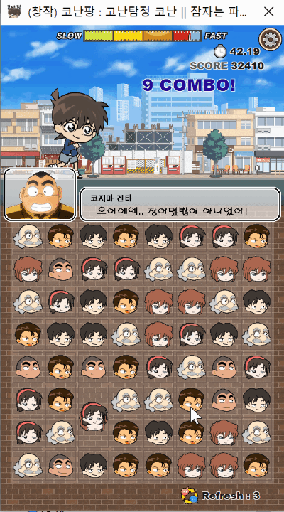


# < 잠자는 파인애옹의 포트폴리오 >

----------

# 고난탐정 코난 (코난팡) 

| 타이틀 | 개발환경 | 제작기간 | Platform |  카테고리 | 비고 
| ---- | ---- | ---- | ---- | ---- | ---- 
| 고난탐정 코난| C++ | 1개월 | Window API | Puzzle| 명탐정 코난 모티브, 쓰리매치 창작 게임
 
>명탐정코난을 테마로한 쓰리매치게임입니다.  
>게임에 사용된 블록 이미지와 상단 애니메이션의 이미지는 **직접** 일러스트레이터로 **그렸습니다**.  

 
*1분간의 게임에서 느껴지는 숨막히는 추격전.* 

* [이미지에 담지 못한 사운가 있는 전체 플레이영상](https://www.youtube.com/playlist?list=PLwLVhT_yp_30l9Nh_r0i_C7ovwvdltuge)
* [이렇게 만들어왔어요](https://www.youtube.com/playlist?list=PLwLVhT_yp_30l9Nh_r0i_C7ovwvdltuge)

### 게임 다운로드
* (준비중)

### 활용 기술/기법
1. STL Vector
2. Iterator
3. 블록의 매치 검사
4. 블록의 이동

###  주요 작업 목록
|  | ★★★ | ★★ | ★ | 
|---- | ---- | ---- | ---- |
| 기여도 |  |  |   |
| 난이도 |  |  |   |
| 소요시간 |  |  |  |

[◀ 목차로 돌아가기](https://github.com/Song-In-Love/pinaeongs-portfolios/blob/master/README.md#목차)

----------

 ⓒ 2020, SONG IN AE 

