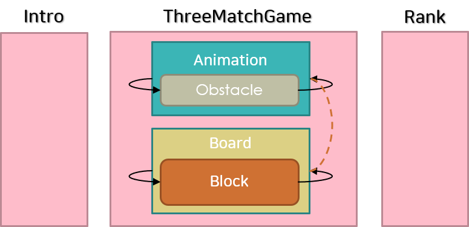
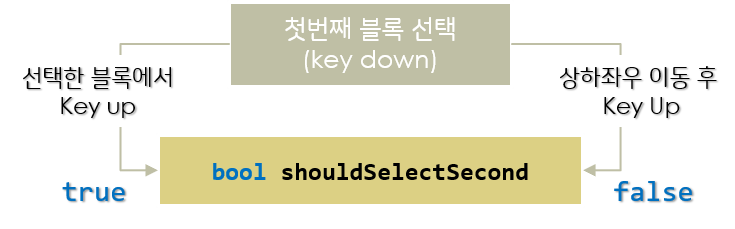


# < 잠자는 파인애옹의 포트폴리오 >

----------


# 고난탐정 코난 (코난팡) 

| 타이틀 | 개발환경 | 제작기간 | Platform |  카테고리 | 비고 
| ---- | ---- | ---- | ---- | ---- | ---- 
| 고난탐정 코난| C++ | 1개월 | Window API | Puzzle| 명탐정 코난 모티브, 쓰리매치 창작 게임
 
>명탐정코난을 테마로한 쓰리매치게임입니다.  
>게임에 사용된 블록 이미지와 상단 애니메이션의 이미지는 **직접** 일러스트레이터로 **그렸습니다**.  

* [이미지에 담지 못한 사운가 있는 전체 플레이영상은 이곳에서... ](https://youtu.be/LNK55V9-VbE)  

  
*1분간의 게임에서 느껴지는 숨막히는 추격전.* 


* [이렇게 만들어왔어요](https://www.youtube.com/playlist?list=PLwLVhT_yp_30l9Nh_r0i_C7ovwvdltuge)


### 게임 다운로드
* [플레이해보기](Hardcarry%20Detective%20Conan.zip) (11.1MB, Zip, Windows10 권장)

### 활용 기술
1. STL Vector
2. Iterator

### 주요 기능


1. 블록의 객체화  
- 각각의 블록들은 스스로 이동함. 
- 블록들은 현재 좌표, 이동 목표 좌표를 가지고 있고, 서로 일치하지 않으면 움직임.
- 블록들은 움직이는 중에는 선택되지 않으며 삭제되지 않음.  
```C++
	POINT nowCoordinate;		//현재 좌표
	POINT goalIndex;			//이동목표 좌표
	POINT tempGoal;
	bool shouldChangeBackGoalIndex;
```
```C++

void Block::move()
{
	if (shouldChangeBackGoalIndex)
	{
		moveTo(tempGoal);
	}
	else if (!shouldChangeBackGoalIndex)
	{
		moveTo(goalIndex);
	}
}

```

```C++
void Block::validateToNeedMove(POINT nowCoordinate, POINT _goalCoordinate)
{
	POINT goalCoordinate;
	goalCoordinate.x = changeIndexToCoordinate(_goalCoordinate.x, COL);
	goalCoordinate.y = changeIndexToCoordinate(_goalCoordinate.y, LOW);

	if ((nowCoordinate.x == goalCoordinate.x) &&
		(nowCoordinate.y == goalCoordinate.y))
	{ 
		inMoving = false; 
	}
	else if ((nowCoordinate.x != goalCoordinate.x) || (nowCoordinate.y != goalCoordinate.y))
	{ 
		inMoving = true;
	}
	else
	{
		//shouldBeMoved = true; 
		inMoving = true;
	}
}
```
2. 블록 매치 검사  
- 블록들은 update()에서 움직임의 상태에 대해 Board에 정보를 전달하고, Board는 블록들의 신호로 매치검사의 플래그가 되는 Bool값을 수정함.
```C++
void Block::checkCall()
{
	if (inMoving)
	{
		board->shouldCheck(false);
	}
	else
	{
		board->shouldCheck(true);
	}
}
```

3. 매치된 블록 삭제
- 보드 안의 모든 블록이 멈춰있는 상태면, 블록들의 매치 정보를 초기화 하고 검사와 삭제를 진행함.
```C++
void BlockBoard::tryToValidateForMatch()
{
	if (hasStopped)
	{ 	
		//체크 전 초기화
		changeMatchStateToFalseON();

		//가로 검사
		validateToMatch(DOWN);
		validateToMatch(RIGHT);

		if (GetTickCount64() % 10 == 0)
		{
			deleteMatchedBlock();
		}
	}
}
```


4. 블록의 교환 방법
- 슬라이드 / 클릭, 두 가지의 방법으로 블록을 교환 할 수 있도록 하기 위해, 마우스 버튼 동작 기준으로 함수를 나누어 처리함
 
```C++
void BlockBoard::selectBlock()
{ 
	if (!isFirstSelected && !shouldSelectSecond)	//처음블록 선택
	{
		firstBlock = selectFirstBlock();
	}
	else if (isFirstSelected && shouldSelectSecond)
	{
		selectSecondBlockByClick();
	}
	else if (isFirstSelected && !shouldSelectSecond)
	{
		//선택한 블록에서 keyUp -> 두번째 블록 선택 필요
		if (PtInRect(&firstBlock->getRect(), _ptMouse) && KEYMANAGER->isOnceKeyUp(VK_LBUTTON))
		{
			shouldSelectSecond = true;
		}
		//아니면 드래그해서 keyUp -> keyUp한 블록과 비교
		else
		{
			selectSecondBlockBySlide();
		}
	}
}
```


[◀ 목차로 돌아가기](https://github.com/Song-In-Love/pinaeongs-portfolios/blob/master/README.md#목차)


----------
<center> ⓒ 2020, SONG IN AE </center>

