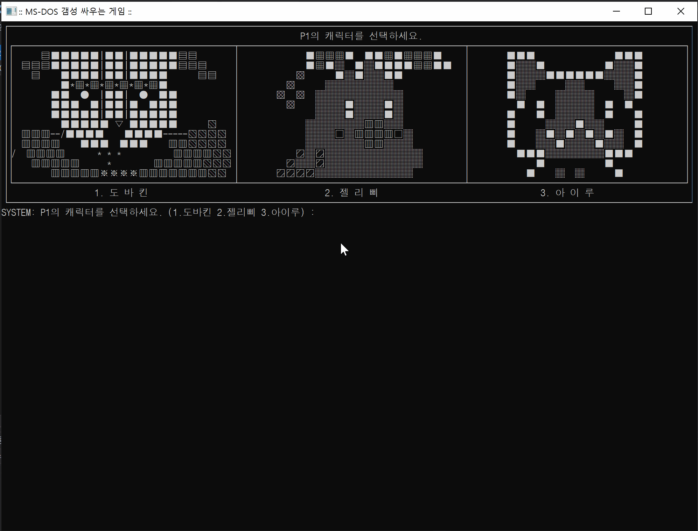

# < 잠자는 파인애옹의 포트폴리오 >

----------

# 도스감성 격투게임

| 타이틀 | 개발환경 | 제작기간 | 플랫폼 |  카테고리 | 비고 
| ---- | ---- | --- | ---- | ---- | ---- 
| 도스감성 격투게임 | C | 3일 | Console | Dos 대전 | C 첫 작품, 머드게임 

>프로그래밍을 처음 접하고 일주일 뒤에 만든 게임입니다.  
>가장 원초적인 그래픽 인터페이스인 텍스트 출력과 C의 기본 구문들을 사용해서 제작하였습니다.  

  
*몰입감은 당신이 예상하는 DOS의 그것과 차원이 다르다. - 파인애옹*

### 게임 다운로드 
* (준비중)


###  주요 작업 목록

|  | ★★★ | ★★ | ★ | 
|---- | ---- | ---- | ---- |
| 기여도| 선택한 플레이어에 따라 스킬, 능력치, 이미지가 다르게 출력  | 상태가 시각적으로 보여지기 (■■■■□□)  | 공격과 피격모션을 움직이게 보이기
| 난이도 | (기여도★★★와 동일)| 서로 다른 캐릭터의 HP량이 다르더라도 칸은 균일하게 보이기| 매 턴마다 HP회복
| 소요 시간| 그림 그리기 (움직이는 효과 보여지게 하기) | 가급적 코드 반복을 줄이기 위해 함수로 만들기 | 공격에 따른 HP 및 MP 감소효과


### 활용 기술/기법
1. C의 조건문(if/switch) 
```C++
case 2: //젤리피일때
      switch (attackStyle) // 사용한 공격
      {
      case 1:
         if (sceneNo == 1)
         {
            cout << "SYSTEM : 젤리삐(이)가 건방지게 침을 밷는다." << endl;
         }
         else if (sceneNo == 2)
         {
            cout << "SYSTEM : 산성이었다. 아프다. " << endl;
         }
         break;
      case 2:
         if (sceneNo == 1)
         {
            cout << "SYSTEM : 젤리삐(이) 줄기 채찍을 휘둘렀다." << endl;
         }
         else if (sceneNo == 2)
         {
            cout << "SYSTEM : 아프지만 묘하게 기분이 좋다. " << endl;
         }
         break;
```
2. 함수 작성 및 전방선언 


[◀ 목차로 돌아가기](../README.md) 


----------
<center> ⓒ 2020, SONG IN AE </center>